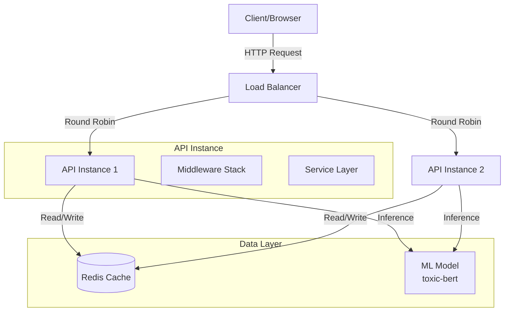
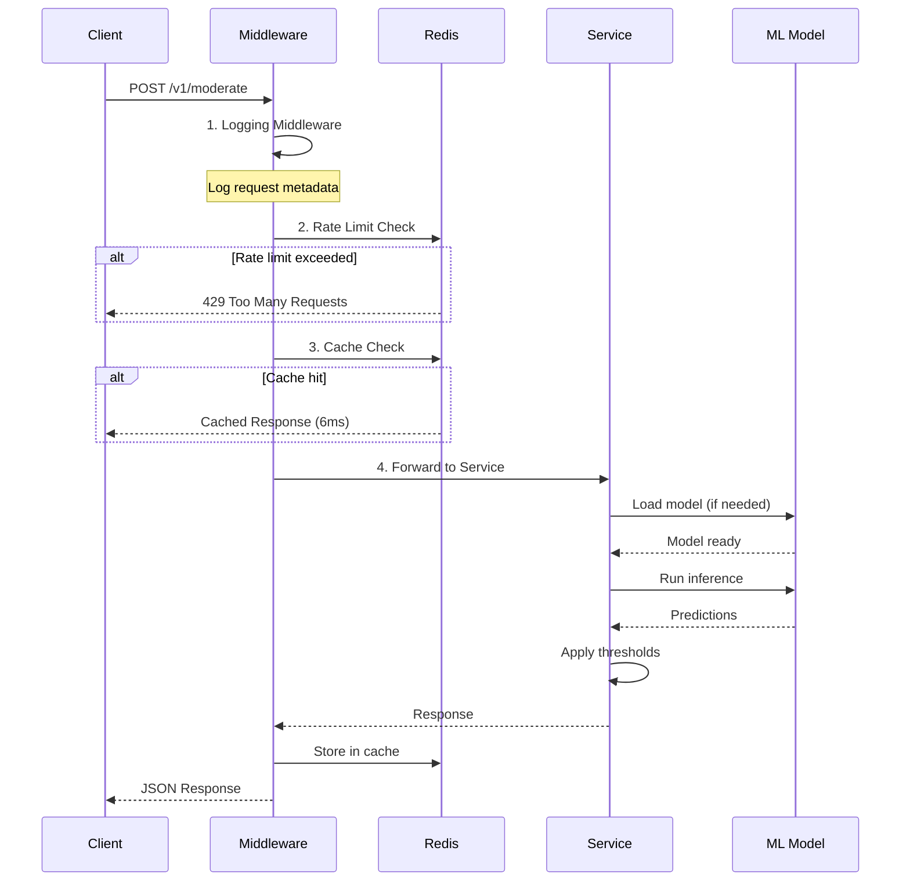

# System Architecture

## Table of Contents
1. [Overview](#overview)
2. [Architecture Diagram](#architecture-diagram)
3. [Component Details](#component-details)
4. [Request Flow](#request-flow)
5. [Algorithms & Data Structures](#algorithms--data-structures)
6. [Scalability](#scalability)
7. [Security](#security)

---

## Overview

The Moderation API is built using a **layered architecture** pattern with clear separation of concerns:

```
┌─────────────────────────────────────────────────────┐
│                   Client Layer                       │
│          (HTTP Requests, External Services)          │
└──────────────────────┬──────────────────────────────┘
                       │
┌──────────────────────▼──────────────────────────────┐
│                 API Gateway Layer                    │
│           (FastAPI, Routing, Middleware)             │
│  ┌──────────┐  ┌───────────┐  ┌──────────────┐    │
│  │ Logging  │  │Rate Limit │  │   Caching    │    │
│  │Middleware│  │ Middleware│  │  Middleware  │    │
│  └──────────┘  └───────────┘  └──────────────┘    │
└──────────────────────┬──────────────────────────────┘
                       │
┌──────────────────────▼──────────────────────────────┐
│               Business Logic Layer                   │
│          (Services, Model Inference)                 │
│  ┌──────────────┐  ┌────────────────┐              │
│  │ Moderation   │  │  Health Check  │              │
│  │   Service    │  │    Service     │              │
│  └──────────────┘  └────────────────┘              │
└──────────────────────┬──────────────────────────────┘
                       │
┌──────────────────────▼──────────────────────────────┐
│                 Data Layer                           │
│  ┌──────────────┐  ┌────────────────┐              │
│  │    Redis     │  │   ML Model     │              │
│  │ (Cache/RL)   │  │  (toxic-bert)  │              │
│  └──────────────┘  └────────────────┘              │
└─────────────────────────────────────────────────────┘
```

---

## Architecture Diagram

### Complete System Architecture



### Request Processing Flow



---

## Component Details

### 1. API Gateway (FastAPI)

**Responsibilities:**
- HTTP request/response handling
- Routing to appropriate endpoints
- Middleware execution chain
- Input validation (Pydantic)
- OpenAPI documentation generation

**Key Files:**
- `app/main.py` - Application entry point
- `app/api/v1/moderate.py` - Moderation endpoint
- `app/api/v1/health.py` - Health check endpoint

**Design Decisions:**
- **FastAPI over Flask**: Higher performance (3x faster), automatic OpenAPI docs, built-in async support
- **API versioning** (`/v1/`): Allows future breaking changes without affecting existing clients
- **Pydantic validation**: Type-safe request/response, automatic validation, clear error messages

---

### 2. Middleware Stack

#### a) Logging Middleware

**Purpose**: Structured JSON logging for monitoring and debugging

**Implementation**:
```python
{
  "timestamp": "ISO 8601",
  "request_id": "UUID",
  "method": "POST",
  "path": "/v1/moderate",
  "status_code": 200,
  "processing_time_ms": 45,
  "user_ip": "192.168.1.1"
}
```

**Design Decision**: JSON logs for easy parsing by log aggregation tools (ELK, Datadog)

#### b) Rate Limiting Middleware

**Algorithm**: Sliding Window with Redis Sorted Sets

**Data Structure**:
```python
# Redis Sorted Set
Key: "rate_limit:{ip}:{endpoint}"
Members: "{timestamp}_{uuid}" 
Scores: timestamp

# Operations (O(log N))
ZADD - Add request
ZREMRANGEBYSCORE - Remove old entries
ZCARD - Count requests in window
```

**Why Sorted Sets?**
- O(log N) operations
- Automatic sorting by timestamp
- Efficient range queries
- Accurate sliding window (vs fixed window)

**Flow**:
```
1. Current time: T
2. Remove entries < (T - window)
3. Count remaining entries
4. If count >= limit: Reject (429)
5. Else: Add entry with timestamp
```

#### c) Caching Middleware

**Algorithm**: Content-Based Hashing with TTL

**Cache Key Generation**:
```python
# SHA256 hash of request body
body_hash = sha256(request_body).hexdigest()[:16]
cache_key = f"cache:moderate:{body_hash}"
```

**Why SHA256?**
- Deterministic (same input = same hash)
- Fast computation (~1μs)
- Collision resistance
- Fixed-length keys

**Cache Hit Flow**:
```
Request → Hash Body → Check Redis → Return Cached Response (6ms)
```

**Cache Miss Flow**:
```
Request → Hash Body → Redis Miss → Process → Store Result → Return (50ms)
```

**TTL Strategy**: 1 hour default, configurable per deployment

---

### 3. Service Layer

#### Moderation Service

**Responsibilities:**
- ML model loading and management
- Text inference
- Threshold application
- Result formatting

**Model Loading Strategy**: Lazy + Singleton

```python
_model = None  # Global singleton
_model_lock = threading.Lock()  # Thread-safe loading

def load_model():
    global _model
    if _model is None:
        with _model_lock:
            if _model is None:  # Double-check
                _model = load_from_huggingface()
    return _model
```

**Why Lazy Loading?**
- Faster API startup (~1s vs ~12s)
- Model loads only if needed
- Suitable for serverless/autoscaling

**Threshold Algorithm**:
```python
def apply_thresholds(scores, custom_thresholds=None):
    thresholds = DEFAULT_THRESHOLDS | custom_thresholds
    flags = {cat: score >= thresholds[cat] for cat, score in scores.items()}
    flagged = any(flags.values())
    return flagged, flags
```

---

### 4. Data Layer

#### Redis

**Use Cases**:
1. **Caching**: Response storage
2. **Rate Limiting**: Request tracking
3. **Future**: Session management, feature flags

**Data Structures Used**:
- **Strings**: Cache storage (JSON-serialized responses)
- **Sorted Sets**: Rate limiting (timestamp-ordered requests)

**Connection Pooling**:
```python
redis_pool = ConnectionPool(
    max_connections=50,
    socket_timeout=5,
    retry_on_timeout=True
)
```

**Why Connection Pooling?**
- Reuse TCP connections (faster)
- Limit concurrent connections
- Automatic reconnection

#### ML Model (toxic-bert)

**Model Details**:
- **Architecture**: BERT-based transformer (110M parameters)
- **Training**: Fine-tuned on toxic comment dataset
- **Input**: Text (max 512 tokens)
- **Output**: 6 category probabilities (0.0-1.0)

**Inference Pipeline**:
```
Text → Tokenization → Model Forward Pass → Softmax → Probabilities
```

**Performance**:
- **Cold start**: 12s (model loading)
- **Warm inference**: 40-60ms per text
- **Batch inference**: ~30ms per text (up to 10 texts)

---

## Request Flow

### Successful Request (Cache Miss)

```
1. Client sends POST /v1/moderate
   ↓
2. Logging Middleware: Log request start
   ↓
3. Rate Limit Middleware:
   - Check Redis sorted set
   - Count requests in last 60s
   - If < 100: Continue, add entry
   - If >= 100: Return 429
   ↓
4. Cache Middleware:
   - Hash request body (SHA256)
   - Check Redis for key
   - If found: Return cached (STOP HERE)
   - If not found: Continue
   ↓
5. Pydantic Validation:
   - Validate request schema
   - If invalid: Return 422
   ↓
6. Moderation Service:
   - Load model (if not loaded)
   - Run inference on each input
   - Apply thresholds
   - Format response
   ↓
7. Cache Middleware:
   - Store response in Redis
   - Set TTL = 3600s
   ↓
8. Logging Middleware: Log response
   ↓
9. Return JSON to client
```

**Timing Breakdown**:
- Middleware: ~1ms
- Validation: ~0.5ms
- Inference: ~40ms
- Total: ~42ms (first request)

### Cached Request (Cache Hit)

```
1. Client sends POST /v1/moderate
   ↓
2. Logging Middleware: ~0.5ms
   ↓
3. Rate Limit: ~1ms
   ↓
4. Cache Check: 
   - Redis GET: ~0.5ms
   - Deserialize JSON: ~0.5ms
   - Return response: ~1ms
   ↓
5. Total: ~6ms (40x faster!)
```

---

## Algorithms & Data Structures

### 1. Rate Limiting: Sliding Window

**Time Complexity**: O(log N + M) where N = window size, M = expired entries

**Space Complexity**: O(N) - stores all requests in window

**Pseudocode**:
```python
def check_rate_limit(ip, endpoint):
    key = f"rate_limit:{ip}:{endpoint}"
    now = time.now()
    window_start = now - 60  # 60 second window
    
    # Remove old entries: O(log N + M)
    redis.zremrangebyscore(key, 0, window_start)
    
    # Count current entries: O(1)
    count = redis.zcard(key)
    
    if count >= LIMIT:
        return REJECT
    
    # Add new entry: O(log N)
    redis.zadd(key, {f"{now}_{uuid}": now})
    redis.expire(key, 70)  # Cleanup
    
    return ALLOW
```

**Why not Fixed Window?**
- Sliding window prevents burst at boundary
- Example: Fixed window allows 200 req at boundary (100 end of minute A + 100 start of minute B)
- Sliding window: Always max 100 in any 60-second period

### 2. Caching: Content-Based Hashing

**Hash Function**: SHA256 (cryptographic hash)

**Properties**:
- Deterministic: `hash(A) == hash(B)` if `A == B`
- Fast: ~1μs for typical request
- Collision resistant: Probability ≈ 0

**Cache Key Strategy**:
```python
def generate_cache_key(request_body):
    # Include relevant fields only
    content = json.dumps({
        "inputs": request_body["inputs"],
        "model": request_body.get("model"),
        "thresholds": request_body.get("thresholds")
    }, sort_keys=True)  # Ensure consistent ordering
    
    hash_digest = sha256(content.encode()).hexdigest()
    return f"cache:moderate:{hash_digest[:16]}"
```

### 3. ML Inference: Batch Processing

**Optimization**: Process multiple texts in one forward pass

**Benefit**:
- Single text: 50ms
- 10 texts separately: 500ms
- 10 texts batched: 300ms (40% faster)

**Implementation**:
```python
def batch_inference(texts):
    # Tokenize all texts at once
    tokens = tokenizer(texts, padding=True, truncation=True)
    
    # Single forward pass (GPU parallel)
    with torch.no_grad():
        outputs = model(**tokens)
    
    # Extract probabilities for each text
    probs = softmax(outputs.logits, dim=-1)
    return probs
```

---

## Scalability

### Horizontal Scaling

**Current**: Single instance

**Scale to Multiple Instances**:
```
                  ┌─── API Instance 1 ───┐
Client → LB  ───  ├─── API Instance 2 ───┤  ──→ Redis
                  └─── API Instance N ───┘
```

**No Code Changes Required**:
- Stateless API (no local state)
- Shared Redis for cache/rate limit
- Each instance can handle ~1000 req/sec

**Bottlenecks**:
1. **Redis**: Single instance ~80k ops/sec
   - Solution: Redis Cluster (sharding)
2. **ML Model**: CPU-bound inference
   - Solution: GPU instances or model serving (TensorFlow Serving)

### Vertical Scaling

**CPU Scaling**:
- Current: 4 workers
- Recommended: `workers = (2 * CPU_cores) + 1`
- 8-core machine: 17 workers

**Memory Scaling**:
- Model size: ~450MB
- Per worker: ~500MB (model + overhead)
- 8GB RAM: ~12 workers comfortable

### Database Scaling (Future)

**Current**: No persistent database

**If Adding Database**:
- Read replicas for queries
- Write to primary
- Cache frequent queries

---

## Security

### 1. Input Validation

**Defense**: Pydantic schemas

**Protection Against**:
- SQL Injection: N/A (no SQL)
- XSS: Input sanitization
- Oversized payloads: Max length limits

```python
class ModerationInput(BaseModel):
    text: str = Field(..., min_length=1, max_length=10000)
```

### 2. Rate Limiting

**Defense**: Per-IP limits

**Protection Against**:
- DDoS attacks
- Brute force
- Resource exhaustion

### 3. Secrets Management

**Never Committed**:
- API keys
- Redis passwords
- Model credentials

**Best Practices**:
- Environment variables
- `.env` in `.gitignore`
- Secrets managers (AWS Secrets Manager, Railway secrets)

### 4. CORS

**Configuration**:
```python
CORS_ORIGINS = ["https://yourdomain.com"]  # Production
# Never use ["*"] in production for sensitive APIs
```

---

## Performance Metrics

| Operation | Time | Details |
|-----------|------|---------|
| Cold Start | 12s | Model loading |
| Warm Start | <1s | Already loaded |
| Cache Hit | 6ms | Redis GET |
| Cache Miss | 50ms | ML inference |
| Rate Limit Check | 1ms | Redis sorted set ops |
| Throughput | ~1000 req/sec | 4 workers, cached |

---

## Technology Choices & Rationale

| Choice | Alternative | Why Chosen |
|--------|-------------|------------|
| **FastAPI** | Flask, Django | Async support, automatic docs, type safety |
| **Redis** | Memcached | Richer data structures (sorted sets), persistence |
| **Pydantic** | Marshmallow | Better performance, integrated with FastAPI |
| **toxic-bert** | OpenAI API | Self-hosted, no API costs, data privacy |
| **Docker** | VM | Lightweight, consistent environments |
| **GitHub Actions** | Jenkins | Free for public repos, easy setup |
| **Railway** | Heroku | Modern, better DX, competitive pricing |

---

## Future Enhancements

1. **GPU Acceleration**: Move to GPU instances for 10x faster inference
2. **Model Serving**: Dedicated model server (TensorFlow Serving)
3. **A/B Testing**: Compare different models
4. **Analytics**: Track moderation trends
5. **Webhooks**: Real-time notifications
6. **Multi-Language**: Support non-English text

---

**For interview discussions, focus on:**
- Why Redis for both cache and rate limiting?
- Trade-offs of lazy loading vs eager loading?
- How to scale to 1M requests/day?
- Security considerations for production?
